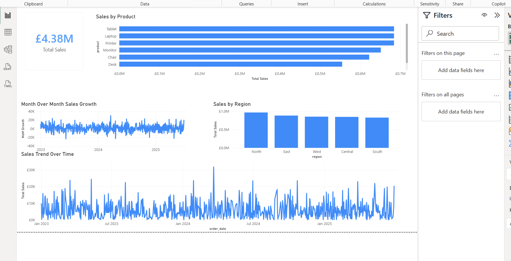
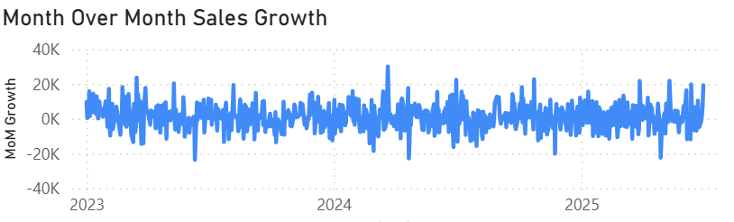

# Sales Performance Dashboard

## Business Problem
Stakeholders require visibility into sales performance to understand revenue trends, identify high-performing products, and detect underperforming regions.

## Objective
Analyse historical sales data using SQL and present insights using an interactive Power BI dashboard.

## Tools Used
- SQL
- Power BI

## Key Metrics
- Total Revenue
- Month-over-Month Growth
- Revenue by Product
- Revenue by Region

## Key Insights
- Revenue peaks in Q4, driven primarily by Product A
- Region X consistently underperforms compared to other regions
- Month-over-Month growth slows mid-year, suggesting seasonality
``

## Dashboard Preview

### Overview

### Month-over-Month Sales Growth

